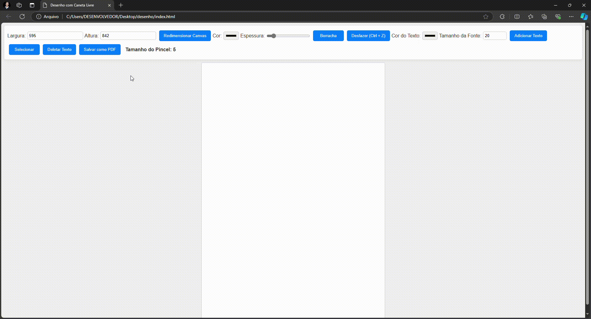
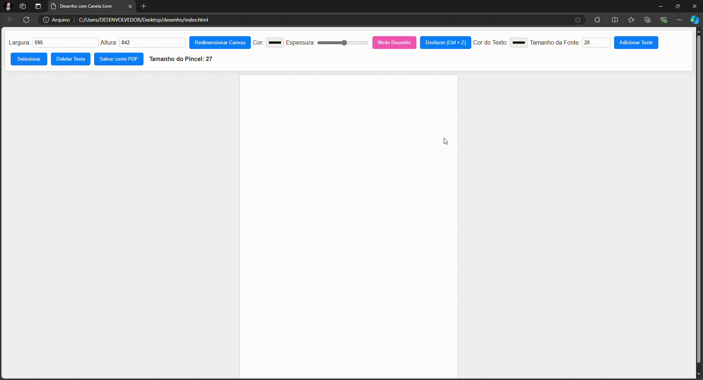
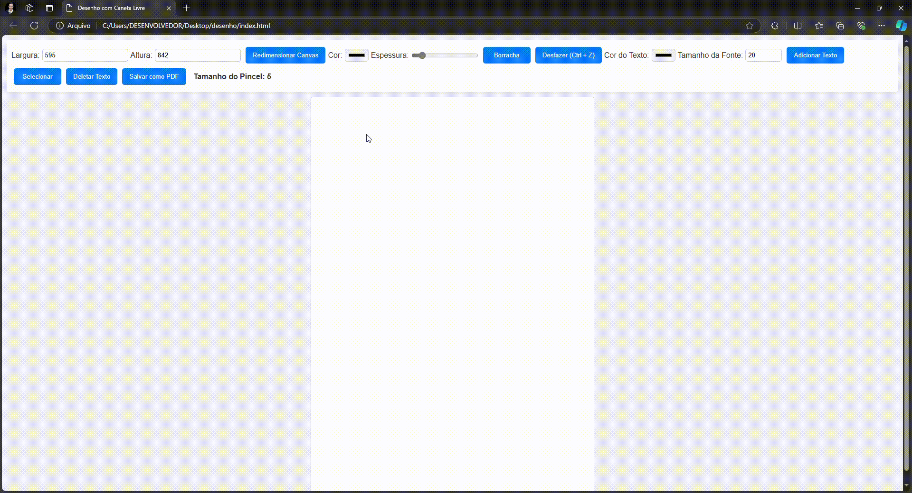

# Sistema de Desenho Interativo

Este sistema permite que os usuários desenhem em um canvas, adicionem texto, apaguem, redimensionem o canvas e exportem seu trabalho como um arquivo PDF. É uma aplicação web simples e intuitiva, ideal para anotações, ilustrações ou qualquer tipo de criação visual.

## Funcionalidades

- **Desenho à Mão Livre**: Use o mouse para desenhar livremente no canvas.
- **Borracha**: Altere para o modo de borracha para apagar partes do desenho.
- **Caixas de Texto**: Adicione texto editável em qualquer lugar do canvas.
- **Selecionar e Mover Texto**: Selecione caixas de texto para movê-las e editá-las.
- **Desfazer Ação**: Desfaça a última ação de desenho ou edição.
- **Redimensionar Canvas**: Ajuste o tamanho do canvas de acordo com suas necessidades.
- **Exportar como PDF**: Salve seu trabalho em formato PDF.

## Tecnologias Utilizadas

- HTML
- CSS
- JavaScript
- jsPDF (para exportação em PDF)

## Estrutura do Projeto

```bash
/desenho-interativo
│
├── index.html          # Página principal com o canvas e a interface
├── style.css           # Estilos para a interface do usuário
├── script.js           # Lógica da aplicação em JavaScript
│
├── img
│   └── logo.png        # Logotipo do projeto (opcional)
│
├── README.md           # Documentação do projeto
```
## Como Usar

1. **Instalação**:
   - Clone ou baixe este repositório.
   - Abra o arquivo `index.html` em um navegador web.

2. **Desenho**:
   - Clique e arraste o mouse no canvas para começar a desenhar.
   - Use o seletor de cor para escolher a cor do pincel.
   - Ajuste o tamanho do pincel com o seletor correspondente.

3. **Apagar**:
   - Clique no botão "Borracha" para ativar o modo de apagar.
   - Clique e arraste sobre o que deseja apagar.

4. **Adicionar Texto**:
   - Clique no botão "Adicionar Texto" para criar uma nova caixa de texto.
   - Digite o texto desejado na caixa.
   - Use a ferramenta de seleção para mover a caixa de texto.

5. **Selecionar e Mover Texto**:
   - Ative o modo de seleção clicando no botão "Selecionar".
   - Clique na caixa de texto que deseja mover.
   - Arraste para a nova posição.

6. **Desfazer Ação**:
   - Clique no botão "Desfazer" para reverter a última ação.
   - Você também pode usar o atalho `Ctrl + Z`.

7. **Redimensionar Canvas**:
   - Insira a nova largura e altura nos campos de entrada correspondentes.
   - Clique no botão "Redimensionar Canvas" para aplicar as mudanças.

8. **Exportar como PDF**:
   - Clique no botão "Salvar como PDF" para exportar o conteúdo do canvas.
   - O arquivo PDF será salvo em seu dispositivo com o nome `drawing.pdf`.

## Demonstração Visual

Aqui estão algumas imagens que mostram o funcionamento do sistema:

  
*Exemplo de desenho no canvas.*

  
*Adicionando uma caixa de texto ao canvas.*

  
*Redimensionando o canvas.*

  
*Exportando o trabalho como PDF.*


## Contribuições

Sinta-se à vontade para contribuir com melhorias ou correções. Abra um issue ou envie um pull request.

## Licença

Este projeto é de domínio público, sinta-se à vontade para usar e modificar conforme necessário.

## Contato

Para perguntas ou sugestões, entre em contato pelo e-mail: jefferson.estevo@gmail.com.
